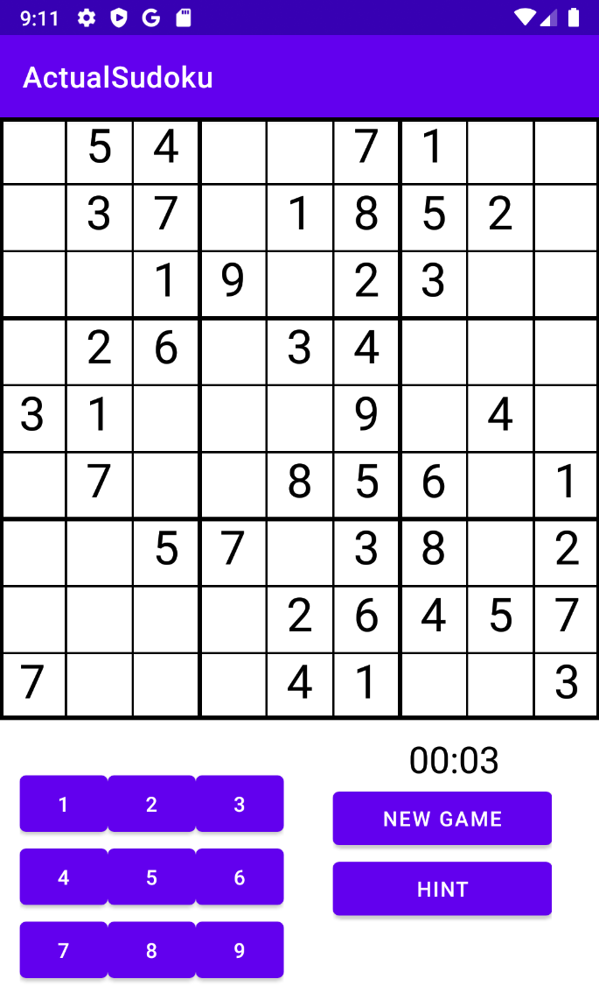

# Sudoku-android-studio
### This repository contains a Sudoku game developed as a university project for an Android development class. The purpose of this project was to learn and practice Android app development, Java, Kotlin programming, and other relevant concepts. The project is a WIP and may be improved upon in the future.
## Overview
The app is built using Android Studio and Java. It features a simple and clean user interface for playing Sudoku including a numpad for input, buttons for hinting a number and generating new sudoku board and a timer. 
Sudok itself is generated using basic implementation of backtracking algorithm.
## Getting started
1.    Install [Android Studio](https://developer.android.com/studio) if you haven't already.
2.    Clone the repository: `git clone https://github.com/kStoko23/Sudoku-android-studio.git`
3.    Open the project in Android Studio.
4.    Make sure you have the required SDKs installed. Android Studio should prompt you to download any missing dependencies.
5.    Build and run the app on an emulator or a physical device.
## Features
- Puzzle generation and validation
- *kinda* User-friendly interface
- Efficiently generated puzzle
- Abbility to provide hints for the player

## Screenshots
### Game view

 

### Game over screen


## Code snippets
***Backtracking algorithm imlpementation***
```java
// solveSudoku(): Solves the sudoku board using the backtracking algorithm
private boolean solveSudoku(int[][] board, int row, int col) {
        if (row == BOARD_SIZE) {
            return true;
        }

        int nextRow = (col == BOARD_SIZE - 1) ? row + 1 : row;
        int nextCol = (col == BOARD_SIZE - 1) ? 0 : col + 1;

        if (board[row][col] != 0) {
            return solveSudoku(board, nextRow, nextCol);
        }

        ArrayList<Integer> nums = new ArrayList<>();
        for (int i = 1; i <= 9; i++) {
            nums.add(i);
        }
        Collections.shuffle(nums);

        for (Integer num : nums) {
            if (isSafe(row, col, num)) {
                board[row][col] = num;
                if (solveSudoku(board, nextRow, nextCol)) {
                    return true;
                }
            }
        }

        board[row][col] = 0;
        return false;
    }
    // isSafe(): Checks if a number is safe to put in the cell by checking row, column, and box
    protected boolean isSafe(int row, int col, int num) {
        return isRowSafe(row, num) && isColSafe(col, num) && isBoxSafe(row - row % 3, col - col % 3, num);
    }
    // isRowSafe(): Checks if a number is safe to put in the row
    private boolean isRowSafe(int row, int num) {
        for (int col = 0; col < BOARD_SIZE; col++) {
            if (board[row][col] == num) {
                return false;
            }
        }
        return true;
    }
    // isColSafe(): Checks if a number is safe to put in the column
    private boolean isColSafe(int col, int num) {
        for (int row = 0; row < BOARD_SIZE; row++) {
            if (board[row][col] == num) {
                return false;
            }
        }
        return true;
    }
    // isBoxSafe(): Checks if a number is safe to put in the 3x3 box
    private boolean isBoxSafe(int rowStart, int colStart, int num) {
        for (int row = 0; row < 3; row++) {
            for (int col = 0; col < 3; col++) {
                if (board[rowStart + row][colStart + col] == num) {
                    return false;
                }
            }
        }
        return true;
    }
```
***Removing numbers randomly t make a valid puzzle***

```java
// removeNumber(): Removes a specified number of cells from the board and returns a list of removed numbers
    public List<RemovedNumber> removeNumbers(int  count) {
        Random random = new Random();
        List<RemovedNumber> removedNumbers = new ArrayList<>();

        Set<Integer> removedPositions = new HashSet<>();
        while (removedNumbers.size() < count) {
            int position = random.nextInt(BOARD_SIZE * BOARD_SIZE);
            if (!removedPositions.contains(position)) {
                removedPositions.add(position);
                int row = position / BOARD_SIZE;
                int col = position % BOARD_SIZE;
                int value = board[row][col];
                if (value != 0) {
                    removedNumbers.add(new RemovedNumber(row, col, value));
                    board[row][col] = 0;
                }
            }
        }

        return removedNumbers;
    }
```


## Work In Progress

There are plans to improve and expand the app's functionality, such as:
- Adding a start menu, with ability for the user to choose difficulty level and app settings (dark/light mode, sounds, choosing color theme of the sudoku)
- Implementing a scoring system
- Rework of the UI to make it more appealing and easier to use
- And more perhaps

## Contributing

Contributions are always welcome! If you'd like to contribute to the project, please follow these steps:

1. Fork the repository.
2. Create a new branch with a descriptive name for your changes.
3. Commit your changes to the new branch, ensuring that you follow the existing code style and practices.
4. Open a pull request with a detailed description of your changes.

Before submitting a pull request, please ensure that your code compiles and runs without any errors, and that it adheres to the project's coding standards.

## Resources used during learning process

1. [GeeksForGeeks](https://www.geeksforgeeks.org/sudoku-backtracking-7/) - backtracking algorithm for solving sudoku
2. [Practical Coding YT channel](https://www.youtube.com/watch?v=lYjSl_ou05Q&t=854s) - good intro to drawing the sudoku board
3. [Wikipedia](https://pl.wikipedia.org/wiki/Sudoku) - Sudoku rules

## License

This project is licensed under the MIT License. See the [LICENSE](/LICENSE.md) file for details.

Please feel free to use this project as a reference or a starting point for your own Sudoku app. If you have any suggestions, improvements, or issues, feel free to open an issue or submit a pull request.
